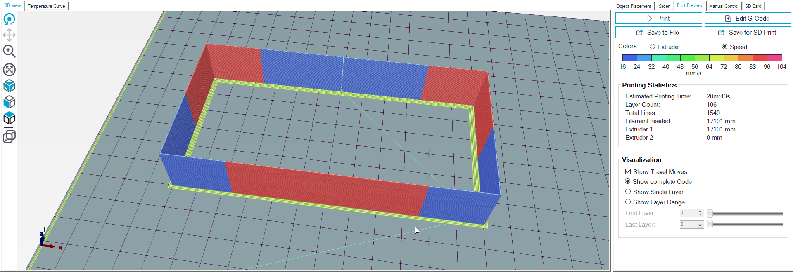

# Kcalibrator
Alternative K-factor calibration pattern generator.
Should provide better (or at least different) way to calibrate Linear Advance (and similar algorithms) than the default [Marlin K-factor Calibration Pattern](https://marlinfw.org/tools/lin_advance/k-factor.html).

## Requirements
Program is written in Python and available in 2 versions:
+ Python script (requires Python 3 to run, no additional packages needed)
+ Windows x64 executable (frozen with pyinstaller, more convenient, no requirements to run)

**Latest Windows executable is available in [releases](https://github.com/ArtificalSUN/Kcalibrator/releases).**

## Usage
This script generates K-factor calibration pattern for extruder pressure control algorithms (Linear Advance, Pressure Advance, Pressure Control, etc.) in different firmwares (Marlin, RepRap Firmware, Klipper, etc.).
The pattern consists of a rectangular wall printed with sharp changes in speed and with K-factor increasing from bottom to top (see screenshot).
Print the pattern and find the height where it looks the best.
Corners should not bulge, flow should be homogeneous with as little influence from speed changes as possible, seam should be barely noticeable.
You can use a backlight to check the thickness of the walls and find the height where it is the same for slow and fast extrusions.
Calculate desired K-factor from this height and parameters you used to generate the pattern.

Program has a graphical user interface allowing to change various settings of the pattern generator and providing simple sanity check (i.e. if pattern does not fit the specified build volume)
User can adjust:
- Basic machine parameters (kinematics, firmware, build volume, filament diameter, autoleveling, etc.)
- Basic printing settings (temperature, cooling, retraction, etc.)
- Pattern parameters (size, speeds, K-factor range and step, number of perimeters, number of layers printed with each specific K-factor, etc.)

Current configuration can be saved to Kcalibrator.cfg file (contributed by [Foreytor](https://github.com/Foreytor)) in the program working directory (it will also be automatically generated if missing on program startup).
Generated G-code files can be saved using system file save dialog.

## Good luck!
